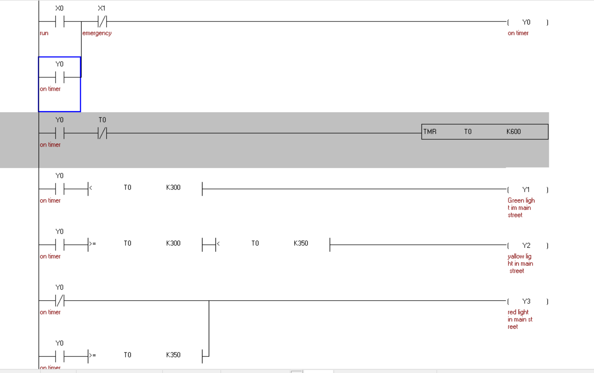
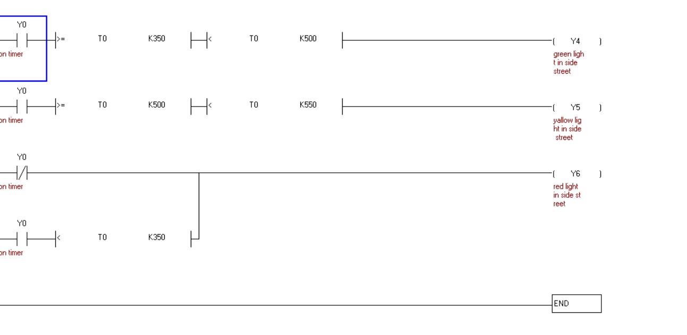

# Traffic Light Control System using PLC

## Project Overview

This project implements an automated traffic light control system using **Delta PLC** and **WPLSoft**.

The system controls a two-road intersection consisting of a **Main Street** and a **Side Street**. The traffic lights operate automatically using timers while ensuring that conflicting green lights are never active at the same time.

The project was developed as part of the PLC Programming laboratory course.

---

## Objectives

- Automate traffic signal operation.
- Prevent vehicle collisions through safety interlocking.
- Apply PLC timer instructions.
- Design a reliable sequential control system.

---

## Software

- WPLSoft
- Delta PLC Ladder Logic

---

## System Operation

The traffic light sequence operates as follows:

### Main Street

- Green ON for 30 seconds.
- Yellow ON for 5 seconds.
- Red ON while the Side Street is active.

### Side Street

- Red while the Main Street is active.
- Green ON for 15 seconds.
- Yellow ON for 5 seconds.
- Returns to Red.

The cycle then repeats continuously.

---

## Safety Features

- Green lights for both roads can never turn ON simultaneously.
- Emergency Stop input can immediately stop the system.
- Sequential timer logic prevents conflicting outputs.

---

## PLC Concepts Used

- Timers (T)
- Internal Relays (M)
- Ladder Logic
- Output Coils (Y)
- Input Contacts (X)
- Interlocking Logic

---

## Learning Outcomes

Through this project I learned:

- PLC sequential programming
- Industrial timer control
- Traffic signal automation
- Ladder Logic design
- Safety interlocking techniques

---
## Ladder Logic

The ladder logic implementation is shown below.

### Part 1

### Part 2

## Author

Mohammed Algoul
Computer Engineering Student
