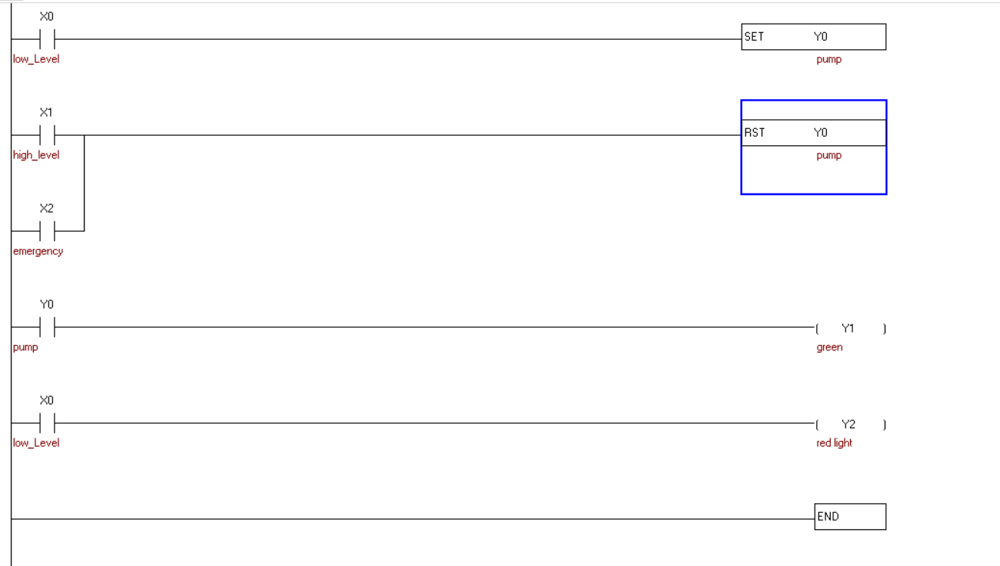

# Automatic Water Tank Level Control using PLC

## Project Overview

This project implements an automatic water tank level control system using **Delta PLC** programmed in **WPLSoft**.

The PLC monitors the water level using two level sensors and automatically controls a water pump to maintain the tank between the minimum and maximum levels.

The program includes latch logic to prevent unnecessary pump switching and improve system reliability.

---

## Objectives

- Automatically maintain the water level.
- Reduce manual operation.
- Prevent rapid pump switching.
- Improve system reliability.

---

## Software

- WPLSoft
- Delta PLC Ladder Logic

---

## System Operation

The control sequence operates as follows:

### Tank Empty

When the Low-Level Sensor is activated:

- The water pump starts.
- The filling indicator turns ON.

### Tank Filling

The pump continues running even after the low-level sensor is released.

This behavior is achieved using latch logic.

### Tank Full

When the High-Level Sensor is activated:

- The pump stops.
- Filling indicator turns OFF.

The system then waits until the tank becomes empty again.

---

## Safety Features

- Pump protection using latch logic.
- Stable operation without rapid ON/OFF switching.
- Reliable automatic water level control.

---

## PLC Concepts Used

- Inputs (X)
- Outputs (Y)
- SET / RESET
- Internal Memory Relays
- Ladder Logic
- Water Level Sensors

---

## Learning Outcomes

This project helped me understand:

- Industrial pump control
- Sensor-based automation
- PLC latch circuits
- Water level management
- Industrial control system design

## Ladder Logic

The following image shows the complete PLC ladder logic implementation.

---

## Author

Mohammed Algoul
Computer Engineering Student
